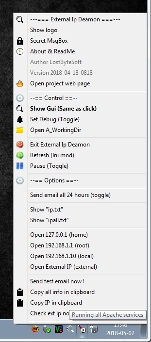
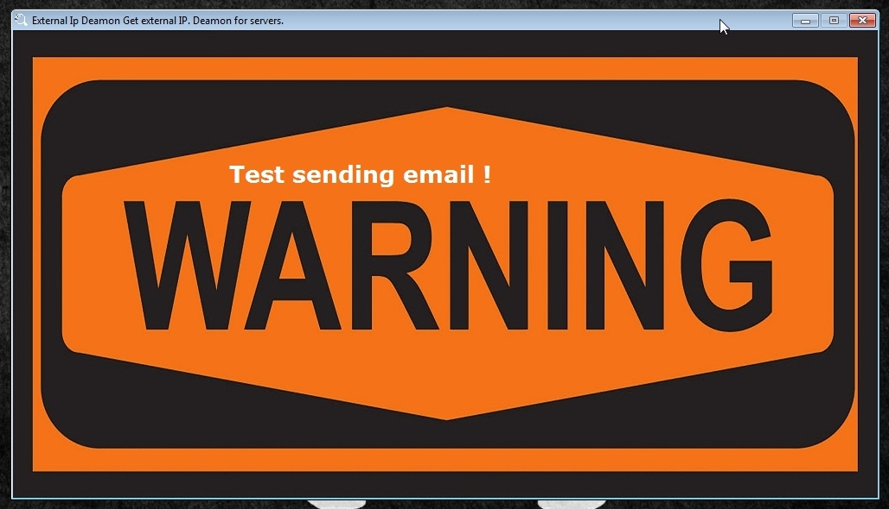

# ExternalIpDeamon
Check youp ISP IP and send e-mail if it change.

Email and password is not crypted in software.

* What this thing do ?

Verify your isp ip all 24 hours and send e-mail at a specified address if it change.

* Some options ?

Can sent e-mail all 24 hours.

Sent test e-mail.

Show a Warning screen when the ip change. (DO not dissapear by itself)

YOU MUST CHANGE THE EMAIL AND PASS IN .AHK FILE BEFORE USE.

* BASED ON SENDMAIL BY :

sendEmail - Send email from a console near you!

Written by: Brandon Zehm <caspian@dotconf.net>

http://caspian.dotconf.net/

http://www.tsheets.com/

sendEmail-1.55 by Brandon Zehm <caspian@dotconf.net>
